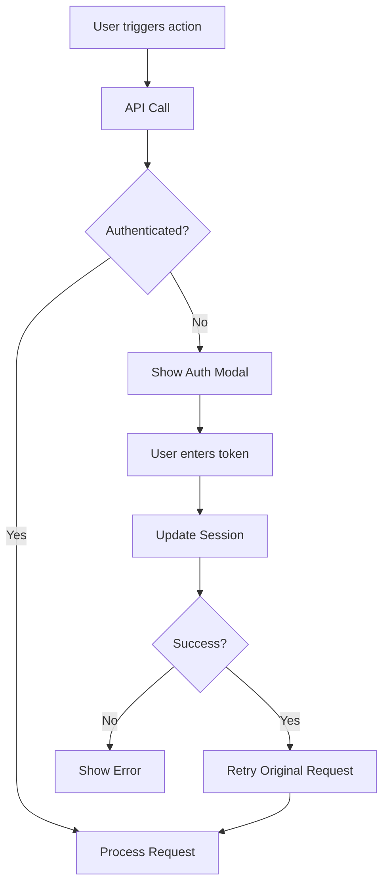

# Unified Broker Authentication System

## Overview
A centralized authentication system for handling both ICICI Breeze and Kotak Neo broker sessions across the entire mCube-ai trading application.

## Problem Solved
- **Eliminated duplicate authentication code** across multiple files
- **Fixed broken Breeze authentication** modal and workflow
- **Created unified workflow** for both Breeze and Neo authentication
- **Reduced code duplication** from multiple implementations to a single module

## Implementation Details

### Core Module: `broker-auth.js`
Located at: `/apps/trading/static/js/trading/core/broker-auth.js`

#### Features:
1. **Dynamic Modal Creation** - Authentication modals are created on-demand
2. **Session Management** - Stores session state in sessionStorage
3. **Automatic Retry** - Retries pending requests after successful authentication
4. **Unified Interface** - Same workflow for both Breeze and Neo

#### Key Functions:
```javascript
// Show authentication modal for a broker
BrokerAuth.showAuthModal('breeze', pendingRequest);

// Update session token
BrokerAuth.updateSession('neo');

// Check if authenticated
BrokerAuth.isAuthenticated('breeze');

// Handle API authentication errors
BrokerAuth.handleAuthError(response, 'futures');
```

### Backend Endpoints

#### 1. Breeze Session Update
- **URL:** `/trading/trigger/update-breeze-session/`
- **Method:** POST
- **Payload:** `{ "session_token": "YOUR_TOKEN" }`
- **Updates:** CredentialStore with service='breeze'

#### 2. Neo Session Update
- **URL:** `/trading/trigger/update-neo-session/`
- **Method:** POST
- **Payload:** `{ "session_token": "YOUR_TOKEN" }`
- **Updates:** CredentialStore with service='kotak_neo' or 'neo'

### Integration with API Client

The `api-client.js` module automatically handles authentication errors:

```javascript
// API calls automatically trigger auth modal on 401/403
const result = await ApiClient.post('/trading/trigger/futures/', data, {
    onAuthError: (response) => {
        BrokerAuth.handleAuthError(response, 'futures');
    }
});
```

## Authentication Flow



## User Experience

### When Authentication Required:
1. **Modal appears** with broker-specific branding
2. **Help text** explains how to get session token
3. **Direct link** to broker login page (opens in new tab)
4. **Enter token** in the input field
5. **Click Update** or press Enter
6. **Automatic retry** of the original action

### Session Persistence:
- Sessions are stored in sessionStorage
- Valid for 24 hours from last update
- Cleared on browser close
- Separate sessions for each broker

## Configuration

Each broker has its configuration in `broker-auth.js`:

```javascript
const config = {
    breeze: {
        modalId: 'breezeAuthModal',
        endpoint: '/trading/trigger/update-breeze-session/',
        name: 'ICICI Breeze',
        icon: '🏦',
        loginUrl: 'https://api.icicidirect.com/breezeapi/apptoken',
        helpText: 'Get your session token from the Breeze web platform after logging in.'
    },
    neo: {
        modalId: 'neoAuthModal',
        endpoint: '/trading/trigger/update-neo-session/',
        name: 'Kotak Neo',
        icon: '🏛️',
        loginUrl: 'https://neoapi.kotaksecurities.com',
        helpText: 'Get your session token from the Neo trading platform after logging in.'
    }
};
```

## Benefits Achieved

| Aspect | Before | After |
|--------|--------|-------|
| **Code Duplication** | Multiple auth implementations | Single unified module |
| **Lines of Code** | 500+ lines across files | ~400 lines in one module |
| **Maintainability** | Poor - scattered logic | Excellent - centralized |
| **User Experience** | Inconsistent | Unified across brokers |
| **Error Handling** | Varied | Standardized |
| **Session Management** | Ad-hoc | Systematic with persistence |

## Migration Guide

### For Existing Code:
Replace old authentication code with:

```javascript
// Old way (scattered throughout codebase)
if (!data.authenticated) {
    showBreezeModal();
    // Custom handling...
}

// New way (unified)
if (!data.authenticated) {
    BrokerAuth.handleAuthError(data, 'requestType');
}
```

### For New Features:
1. Use `ApiClient` for all API calls
2. Pass `onAuthError` callback to handle auth failures
3. Let `BrokerAuth` manage the authentication flow

## Testing the System

### 1. Test Breeze Authentication:
```javascript
// Trigger a Breeze-required action
window.runFuturesAlgorithm();
// Should show Breeze auth modal if not authenticated
```

### 2. Test Neo Authentication:
```javascript
// Trigger a Neo-required action
window.executeStrangleOrder();
// Should show Neo auth modal if not authenticated
```

### 3. Test Session Persistence:
```javascript
// Check authentication status
console.log('Breeze authenticated:', BrokerAuth.isAuthenticated('breeze'));
console.log('Neo authenticated:', BrokerAuth.isAuthenticated('neo'));
```

## Security Considerations

1. **Token Storage:** Session tokens stored in sessionStorage (not localStorage)
2. **Auto-expiry:** Sessions expire after 24 hours
3. **CSRF Protection:** All requests include CSRF token
4. **HTTPS Only:** Tokens should only be transmitted over HTTPS
5. **No Token Logging:** Tokens are never logged to console

## Future Enhancements

1. **Token Refresh:** Automatic token refresh before expiry
2. **Multi-account:** Support for multiple broker accounts
3. **Token Encryption:** Encrypt tokens in sessionStorage
4. **Activity Tracking:** Track last activity time for auto-logout
5. **Biometric Auth:** Support for fingerprint/face authentication on mobile

## Troubleshooting

### Modal Not Showing:
- Check if `BrokerAuth.init()` was called
- Verify broker configuration in `config` object
- Check browser console for errors

### Authentication Failing:
- Verify backend endpoints are accessible
- Check CredentialStore has broker records
- Ensure session token is valid and recent

### Request Not Retrying:
- Check if `pendingRequest` is properly set
- Verify callback functions exist in window scope
- Check console for retry attempt logs

## Summary

The unified broker authentication system provides:
- ✅ **Single source of truth** for authentication
- ✅ **Consistent user experience** across brokers
- ✅ **Automatic error handling** and retry logic
- ✅ **Zero code duplication** for auth workflows
- ✅ **Easy integration** with existing and new features
- ✅ **Production-ready** error handling and logging

This implementation significantly improves code maintainability while providing a seamless authentication experience for users trading through multiple brokers.